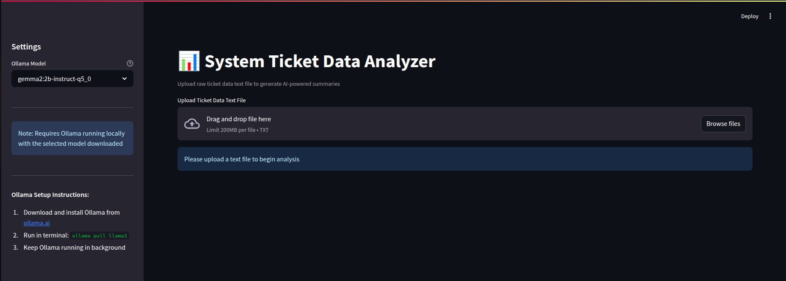

# 🧠 System Ticket Data Analyzer

 

A Streamlit app that turns raw ticket dumps into structured insights, AI-generated summaries, and visual stories.

---

## 🚀 Features

### File Processing
- Drag-and-drop text files with ticket data  
- Auto-converts to structured format  
- Cleans and validates records  

### AI Summaries (Powered by Local LLM)
- Timeline-based narratives for each product  
- Five focused story sections per category  
- Offline-friendly via [Ollama](https://ollama.ai) LLMs  

### Visual Insights
- Ticket volume trends over time  
- Resolution time distribution  
- Interactive story timeline  

### Product Mapping
- Auto-maps service categories to products  
- Built-in classification: Broadband, Voice, TV, GIGA, VOD, Hardware  

---

## ⚙️ Installation

### Requirements
- Python ≥ 3.8  
- [Ollama](https://ollama.ai) installed and configured  
- Model used in testing: `gemma2:2b-instruct-q5_0`

### Setup

```bash
git clone https://github.com/hossamrizk/ticket-data-analyzer.git
cd ticket-data-analyzer
cd src/
pip install -r requirements.txt
ollama pull gemma2:2b-instruct-q5_0
```

---

## Usage

```bash
cd src/
streamlit run main.py
```

Visit [localhost:8501](http://localhost:8501) to:

- Upload ticket data  
- View AI-generated product summaries  
- Interact with visualizations  
- Browse cleaned data in a table  

---

## Configuration

Available in the sidebar:

- Change LLM models  

---

## 📃 Project Structure

```plaintext
ticket-data-analyzer/
├── src/
│   ├── main.py                   
│   ├── models/                  
│   │   ├── data_loader.py       
│   │   ├── data_processor.py    
│   │   ├── category_mapper.py  
│   │   └── timeline_analyzer.py 
│   ├── documentation/                 
│   │   ├── Code.md       
│   │   ├── Implementation.md
│   ├── helpers/                 
│   │   ├── initialize_components.py       
│   │   ├── process_uploaded_file.py    
│   │   ├── render_analysis.py
│   ├── services/                
│   │   ├── ai_service.py        
│   │   └── prompt_generator.py  
│   ├── views/                   
│   ├── controllers/            
│   └── requirements.txt           
├── README.md             
```

